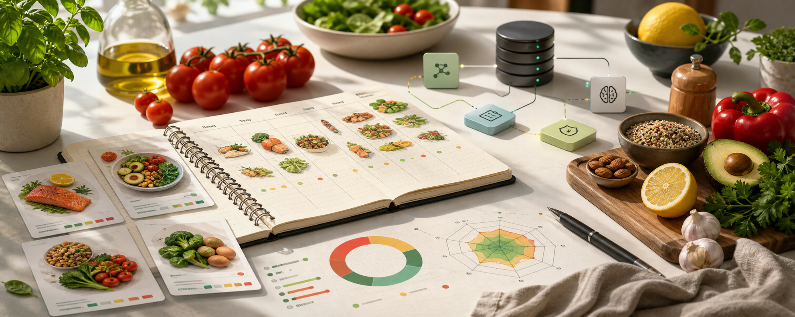
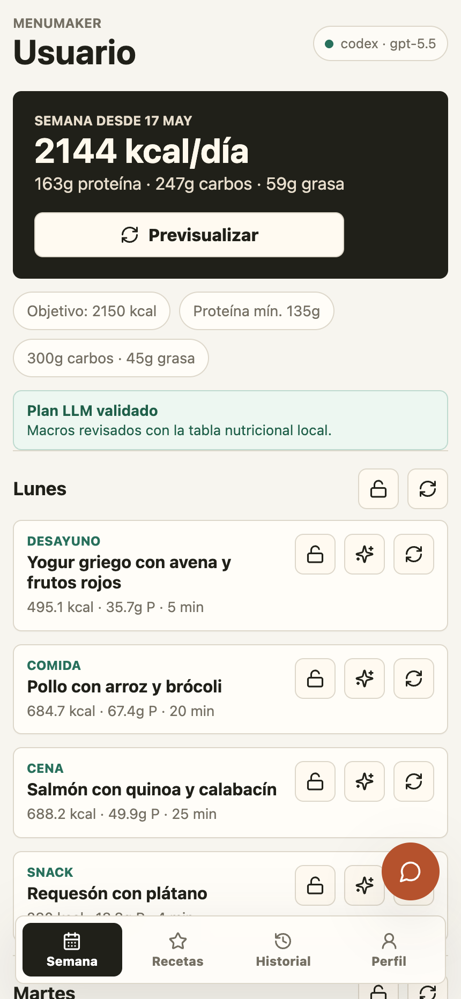
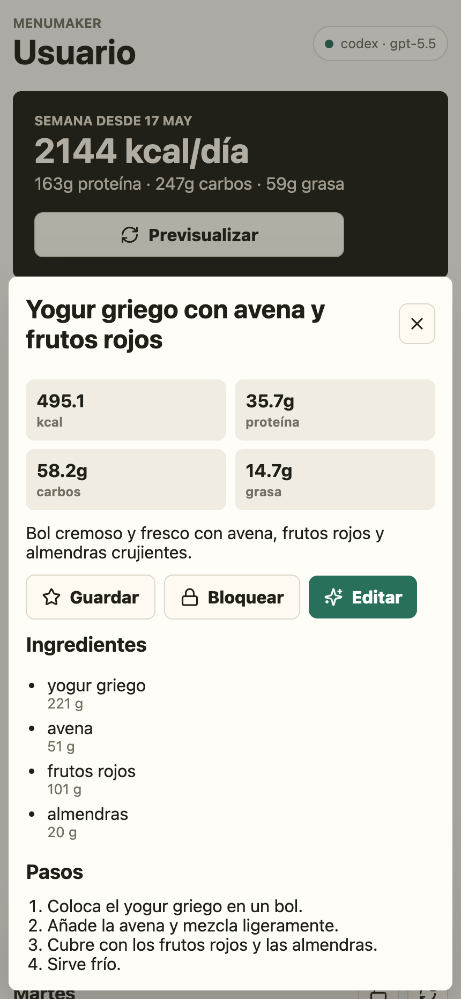
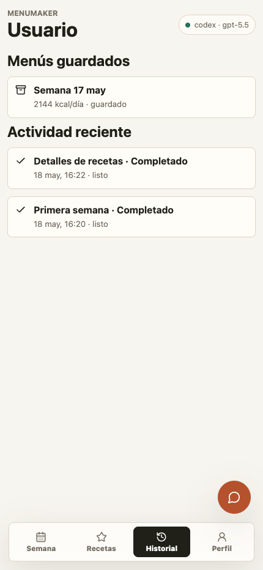
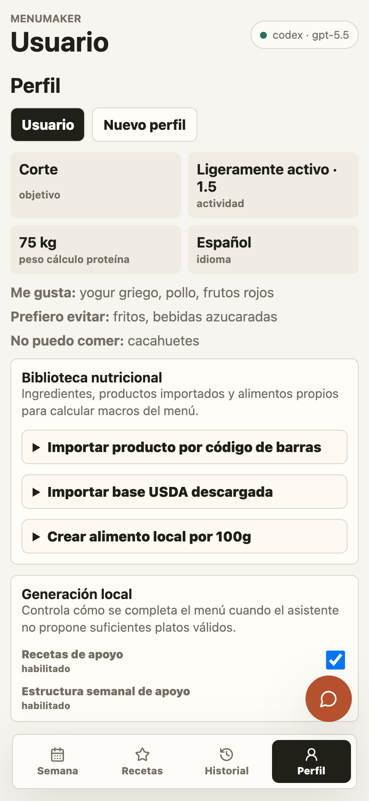
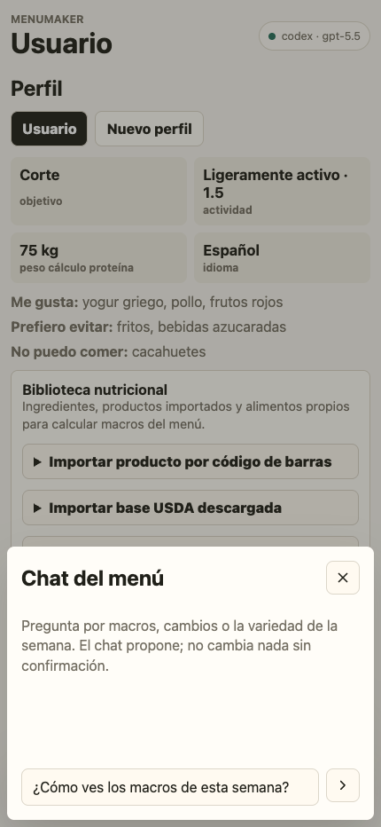
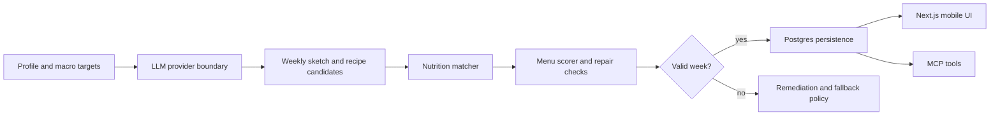

<p align="center">
  
</p>

<h1 align="center">MenuMaker</h1>

<p align="center">
  <strong>Local-first weekly menu planning with deterministic nutrition checks and LLM-assisted meal generation.</strong>
  <br>
  Spanish-first diet planning, macro targets, recipe regeneration, provider-swappable AI, and MCP tools for agent workflows.
</p>

<p align="center">
  
  
  
  
</p>

<p align="center">
  <code>typescript</code>
  ·
  <code>nextjs</code>
  ·
  <code>postgres</code>
  ·
  <code>llm</code>
  ·
  <code>nutrition</code>
  ·
  <code>meal-planning</code>
  ·
  <code>local-first</code>
  ·
  <code>mcp</code>
</p>

<p align="center">
  <a href="#overview">Overview</a>
  ·
  <a href="#features">Features</a>
  ·
  <a href="#architecture">Architecture</a>
  ·
  <a href="#quick-start">Quick Start</a>
  ·
</p>

---

## Overview

MenuMaker is a local-first mobile web app for planning weekly diets around a personal profile. It combines LLM-generated meal ideas with deterministic nutrition calculation, ingredient matching, menu scoring, fallback policy controls, and a local Postgres-backed application service.

The LLM proposes recipes, but the app validates ingredients, macros, banned foods, repetition, nutrition confidence, and menu quality before persisting a week.

<p align="center">
  
</p>

## Features

MenuMaker is deliberately mobile-first: the main workflow is a week view with regeneration controls, lock states, meal-level traceability, saved recipes, generation history, profile controls, and an assistant that can propose changes without applying them silently.

<table>
  <tr>
    <td width="50%">
      
    </td>
    <td width="50%">
      <h3>Recipe details are auditable</h3>
      <p>Each meal exposes calculated calories, macro breakdown, normalized ingredients, and preparation steps. The UI keeps the recipe idea separate from the nutrition math that validates it.</p>
    </td>
  </tr>
  <tr>
    <td width="50%">
      <h3>Generation is observable</h3>
      <p>Saved menus and recent generation activity are visible in the app, so users can tell what changed and whether a new plan is ready.</p>
    </td>
    <td width="50%">
      
    </td>
  </tr>
  <tr>
    <td width="50%">
      
    </td>
    <td width="50%">
      <h3>Local controls stay explicit</h3>
      <p>Profiles, nutrition imports, local food creation, and fallback behavior are surfaced as product controls instead of hidden scripts. This keeps live LLM testing and local fallback behavior easy to inspect.</p>
    </td>
  </tr>
</table>

<table>
  <tr>
    <td width="50%">
      <h3>LLM-First Menu Generation</h3>
      <p>Generates weekly sketches, recipe candidates, chat answers, and trace summaries through a provider boundary. Codex OAuth and Gemini API calls are both supported.</p>
    </td>
    <td width="50%">
      <h3>Deterministic Nutrition Engine</h3>
      <p>Scores generated recipes against local nutrition data, macro targets, ingredient confidence, banned foods, prep time, and repetition limits before selecting meals.</p>
    </td>
  </tr>
  <tr>
    <td width="50%">
      <h3>Mobile Web App</h3>
      <p>Next.js interface for onboarding, profile settings, weekly menus, regeneration controls, fallback policy, and meal-level traceability.</p>
    </td>
    <td width="50%">
      <h3>Local Data Model</h3>
      <p>Postgres schema for profiles, menus, recipes, nutrition sources, AI cache rows, generation jobs, remediation actions, and ownership boundaries.</p>
    </td>
  </tr>
  <tr>
    <td width="50%">
      <h3>Agent-Ready MCP Server</h3>
      <p>Local MCP tools expose planning, profile, fallback, import, and replacement workflows for Codex-style agent operation.</p>
    </td>
    <td width="50%">
      <h3>Explicit Fallback Controls</h3>
      <p>Deterministic recipes remain available when a provider is unavailable, but fallback usage is surfaced and can be disabled for live LLM quality testing.</p>
    </td>
  </tr>
</table>

The in-app chat follows the same safety model as the MCP surface: it can interpret menu requests, but destructive or meaningful changes are routed through explicit actions and confirmation.

<p align="center">
  
</p>

## Architecture



The monorepo is organized around explicit packages:

```text
apps/
  web/                 Next.js mobile web app and route handlers
  mcp/                 local MCP server for agent-facing tools
packages/
  ai/                  Codex OAuth and Gemini provider adapters, prompts, schemas
  core/                shared types, macro policy, Zod schemas
  db/                  Postgres schema, migrations, app service, generation worker
  nutrition/           deterministic food catalog and nutrition scoring engine
skills/
  menumaker/           Codex skill contract for local agent operation
```

## Quick Start

MenuMaker expects a local Postgres database named `menumaker`.

```bash
npm install
cp .env.example .env
npm run setup:local
npm run dev:web
```

Open `http://localhost:3000` on the development machine after the web server starts.

For the MCP server:

```bash
npm run dev:mcp
```

## Configuration

Common `.env` values:

```env
DATABASE_URL=postgres://localhost:5432/menumaker
LOCAL_USER_ID=00000000-0000-4000-8000-000000000001

# codex or gemini
MENUMAKER_LLM_PROVIDER=gemini

# Codex OAuth provider
CODEX_AUTH_PROFILE=~/.codex/auth.json
CODEX_MODEL=gpt-5.4-mini
CODEX_REASONING_EFFORT=medium

# Gemini provider
GEMINI_API_KEY=
GEMINI_MODEL=gemini-3.1-flash-lite

# Live-testing control
ALLOW_RECIPE_TEMPLATE_FALLBACK=true
```

Set `ALLOW_RECIPE_TEMPLATE_FALLBACK=false` when testing live provider behavior. In that mode, generation fails loudly instead of silently filling missing candidates with deterministic templates.

## Verification

```bash
npm run typecheck
npm test
npm run build
```

The test suite covers nutrition scoring, calorie planning, source imports, generation-job behavior, remediation, ownership boundaries, and week-quality checks.

## License

MIT
