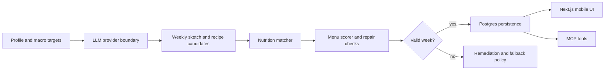

<h1 align="center">MenuMaker</h1>

<p align="center">
  <strong>Local-first weekly menu planning with deterministic nutrition checks and LLM-assisted meal generation.</strong>
  <br>
  Spanish-first diet planning, macro targets, recipe regeneration, provider-swappable AI, and MCP tools for agent workflows.
</p>

<p align="center">
  
  
  
  
</p>

<p align="center">
  <a href="#overview">Overview</a>
  ·
  <a href="#features">Features</a>
  ·
  <a href="#architecture">Architecture</a>
  ·
  <a href="#quick-start">Quick Start</a>
  ·
  <a href="#portfolio-notes">Portfolio Notes</a>
</p>

---

## Overview

MenuMaker is a local-first mobile web app for planning weekly diets around a personal profile. It combines LLM-generated meal ideas with deterministic nutrition calculation, ingredient matching, menu scoring, fallback policy controls, and a local Postgres-backed application service.

The project is built as a portfolio-safe snapshot of a real planning system: the LLM suggests recipes, but the app validates ingredients, macros, banned foods, repetition, and menu quality before persisting a week.

## Features

<table>
  <tr>
    <td width="50%">
      <h3>LLM-First Menu Generation</h3>
      <p>Generates weekly sketches, recipe candidates, chat answers, and trace summaries through a provider boundary. Codex OAuth and Gemini API calls are both supported.</p>
    </td>
    <td width="50%">
      <h3>Deterministic Nutrition Engine</h3>
      <p>Scores generated recipes against local nutrition data, macro targets, ingredient confidence, banned foods, prep time, and repetition limits before selecting meals.</p>
    </td>
  </tr>
  <tr>
    <td width="50%">
      <h3>Mobile Web App</h3>
      <p>Next.js interface for onboarding, profile settings, weekly menus, regeneration controls, fallback policy, and meal-level traceability.</p>
    </td>
    <td width="50%">
      <h3>Local Data Model</h3>
      <p>Postgres schema for profiles, menus, recipes, nutrition sources, AI cache rows, generation jobs, remediation actions, and ownership boundaries.</p>
    </td>
  </tr>
  <tr>
    <td width="50%">
      <h3>Agent-Ready MCP Server</h3>
      <p>Local MCP tools expose planning, profile, fallback, import, and replacement workflows for Codex-style agent operation.</p>
    </td>
    <td width="50%">
      <h3>Explicit Fallback Controls</h3>
      <p>Deterministic recipes remain available when a provider is unavailable, but fallback usage is surfaced and can be disabled for live LLM quality testing.</p>
    </td>
  </tr>
</table>

## Architecture



The monorepo is organized around explicit packages:

```text
apps/
  web/                 Next.js mobile web app and route handlers
  mcp/                 local MCP server for agent-facing tools
packages/
  ai/                  Codex OAuth and Gemini provider adapters, prompts, schemas
  core/                shared types, macro policy, Zod schemas
  db/                  Postgres schema, migrations, app service, generation worker
  nutrition/           deterministic food catalog and nutrition scoring engine
skills/
  menumaker/           Codex skill contract for local agent operation
```

## Quick Start

MenuMaker expects a local Postgres database named `menumaker`.

```bash
npm install
cp .env.example .env
npm run setup:local
npm run dev:web -- --hostname 0.0.0.0 --port 3000
```

Open the printed LAN URL from a phone on the same network, or use `http://localhost:3000` on the development machine.

## Configuration

Common `.env` values:

```env
DATABASE_URL=postgres://localhost:5432/menumaker
LOCAL_USER_ID=00000000-0000-4000-8000-000000000001

# codex or gemini
MENUMAKER_LLM_PROVIDER=gemini

# Codex OAuth provider
CODEX_AUTH_PROFILE=~/.codex/auth.json
CODEX_MODEL=gpt-5.4-mini
CODEX_REASONING_EFFORT=medium

# Gemini provider
GEMINI_API_KEY=
GEMINI_MODEL=gemini-3.1-flash-lite

# Live-testing control
ALLOW_RECIPE_TEMPLATE_FALLBACK=true
```

Set `ALLOW_RECIPE_TEMPLATE_FALLBACK=false` when testing live provider behavior. In that mode, generation fails loudly instead of silently filling missing candidates with deterministic templates.

## Verification

```bash
npm run typecheck
npm test
npm run build
```

The test suite covers nutrition scoring, calorie planning, source imports, generation-job behavior, remediation, ownership boundaries, and week-quality checks.

## Portfolio Notes

MenuMaker demonstrates:

- provider-swappable LLM integration with structured output
- deterministic validation around probabilistic recipe generation
- local-first product architecture with a clean service boundary
- Postgres schema design for AI cache, generation jobs, and user-owned data
- TypeScript monorepo organization across app, domain, data, and AI layers
- practical MCP tool design for controlled agent operation
- focused tests around failure modes rather than only happy paths

This public snapshot is meant to show product engineering judgment: the app uses AI where it helps, then validates the result with boring deterministic code before a user sees or saves a menu.

## License

MIT
